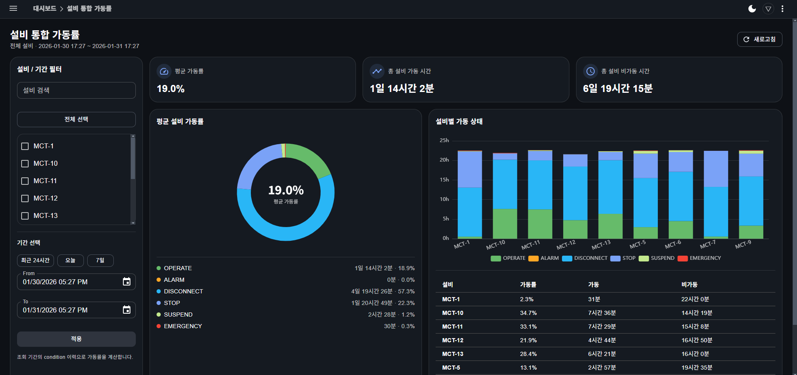
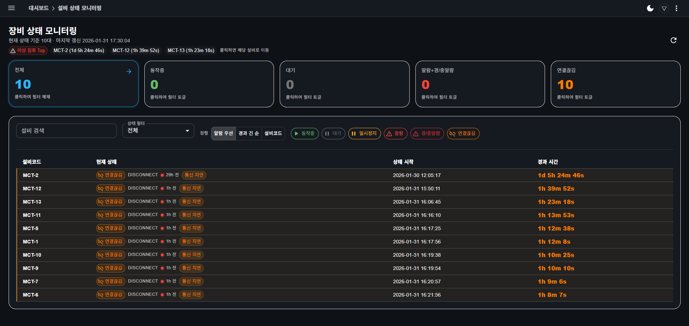

# In-house Dashboard – Equipment & Operation Overview (Ongoing)

설비 및 운영 데이터를 Web 기반으로 한눈에 확인할 수 있도록  
**단독으로 설계·개발을 진행한 내부 대시보드 프로젝트**입니다.

기존 회사 표준이었던 MSSQL 기반 구조에서 벗어나,  
설비 데이터를 **MongoDB로 수집·저장**하고  
Java 서버에서 **MongoDB를 새롭게 연동하여 API를 구성**,  
해당 API를 기반으로 **클라이언트 UI까지 직접 개발**했습니다.

> 본 문서와 화면은 실무 프로젝트를 기반으로 하며,  
> 보안 정책에 따라 일부 정보는 마스킹 처리되었습니다.

---

## Background

- 기존 시스템은 MSSQL 중심 구조로,
  대시보드 특성상 필요한 실시간 조회 및 지표 확장에 제약이 있었음
- 설비 상태 확인을 위해 여러 화면과 데이터를 반복적으로 확인해야 했음
- 운영 현황을 빠르게 파악할 수 있는 별도의 대시보드 구조가 필요하다고 판단

---

## Objective

- 설비 상태를 즉각적으로 파악할 수 있는 대시보드 구성
- 실시간 데이터와 누적 데이터를 함께 확인 가능한 구조 설계
- 기존 RDB 의존도를 낮추고,
  지표 확장에 유연한 데이터 저장·조회 구조 적용

---

## Architecture

Equipment Data → MongoDB → Java Server (MongoDB 연동 / API 제공) → Web Client UI

- 설비 데이터를 MongoDB 컬렉션으로 수집·관리
- Java 서버에서 MongoDB를 직접 연동하여 집계 및 조회 API 구현
- 클라이언트에서는 API 호출을 통해 설비 상태 및 지표를 화면에 표현

---

## Screenshots

### Equipment Status Overview
설비별 가동 상태를 한눈에 확인할 수 있도록 구성된 화면입니다.

---

### Alarm / Abnormal Status
설비 이상 상태를 빠르게 인지할 수 있도록 구성한 화면입니다.

---

### Chart / Trend View
설비 및 운영 지표의 변화 추이를 확인하기 위한 차트 화면입니다.

---

## What I Did

- MongoDB 기반 데이터 모델 및 컬렉션 구조 단독 설계
- Java 서버에 MongoDB 연동 구조 신규 적용
- 설비 상태 판단 기준 정의 및 집계 API 구현
- API 기반 데이터 흐름을 고려한 클라이언트 UI 개발

---

## Considerations

- 지표 추가 시 기존 구조 변경을 최소화할 수 있도록 설계
- 실시간 조회 성능과 집계 성능 간의 균형 고려
- 운영자 관점에서 빠르게 상황을 파악할 수 있는 화면 구성

---

## Tech Stack

- Backend: Java
- Database: MongoDB
- Frontend: Web Client UI
- Domain: Equipment Monitoring / Dashboard

---

## Status

- In Progress  
- 기본 구조 및 데이터 흐름은 구성 완료,  
  운영 요구사항에 따라 기능을 순차적으로 확장 중입니다.
