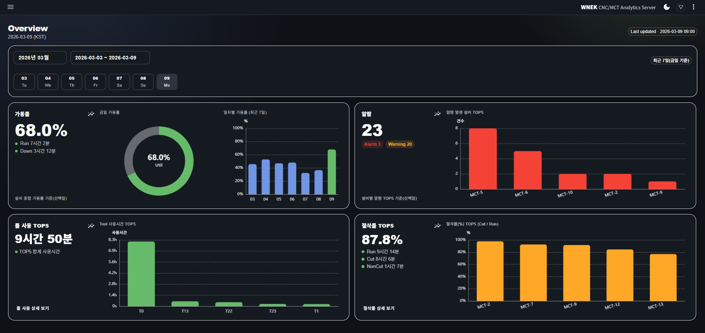
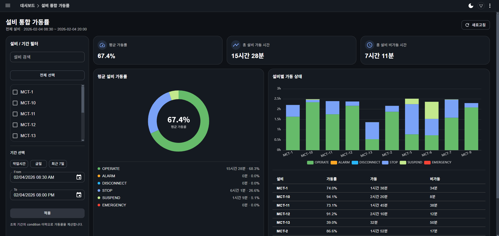
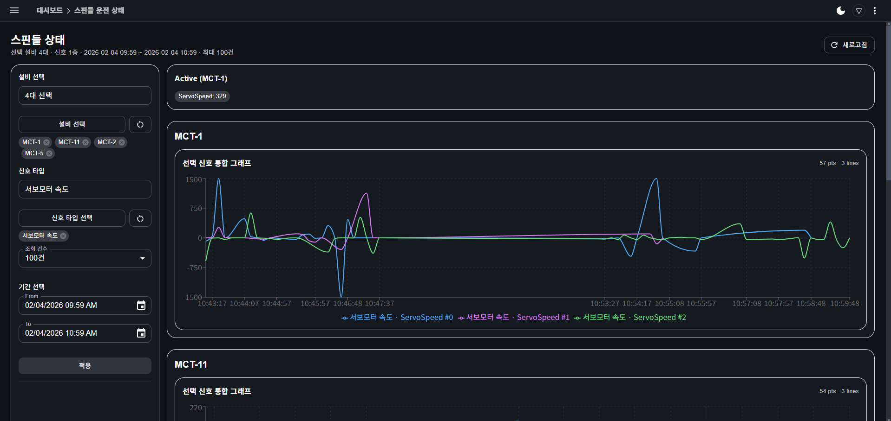

# In-house Dashboard – Equipment & Operation Overview (Ongoing)

> **MongoDB 기반 설비 모니터링 Web Dashboard**
> 기획 · 설계 · 백엔드 · 프론트엔드까지 **단독으로 설계 및 구현한 실무 프로젝트**

설비 및 운영 데이터를 **Web 기반으로 한눈에 확인**할 수 있도록
기획부터 설계·개발까지 **단독으로 진행한 내부 대시보드 프로젝트**입니다.

기존 회사 표준이던 **MSSQL 중심 구조에서 탈피**하여,
설비 데이터를 **MongoDB로 수집·저장**하고
Java 서버에서 **MongoDB를 직접 연동해 API를 구성**,
해당 API를 기반으로 **클라이언트 UI까지 직접 구현**했습니다.

> 본 문서와 화면은 실무 프로젝트를 기반으로 하며,
> 보안 정책에 따라 일부 정보는 마스킹 처리되었습니다.

---

## Background

* 기존 시스템은 MSSQL 중심 구조로,
  대시보드 특성상 실시간 조회 및 지표 확장에 제약이 존재
* 설비 상태 확인을 위해 여러 화면을 반복적으로 확인해야 하는 불편함
* 운영 현황을 직관적으로 파악할 수 있는 **통합 대시보드 필요성 대두**

---

## Objective

* 설비 상태 및 운영 현황을 **즉각적으로 파악**할 수 있는 대시보드 제공
* 실시간 데이터와 누적 데이터를 **동시에 확인 가능한 구조 설계**
* 기존 RDB 의존도를 낮추고,
  **지표 확장에 유연한 데이터 저장·조회 구조** 적용

---

## Architecture

```
Equipment Data
      ↓
   MongoDB
      ↓
Java Server (MongoDB 연동 / API 제공)
      ↓
 Web Client UI
```

* 설비 데이터를 MongoDB 컬렉션 단위로 수집·관리
* Java 서버에서 MongoDB를 직접 연동하여 집계 및 조회 API 구현
* 클라이언트는 API 기반으로 설비 상태 및 지표 시각화
* NoSQL 구조를 활용하여 지표 추가 시 스키마 변경 부담 최소화

---

## Why MongoDB

* 설비 데이터 특성상 **스키마가 자주 변경되고 지표가 지속적으로 추가**됨
* 기존 MSSQL 구조에서는 컬럼 추가 및 프로시저 수정 비용이 큼
* MongoDB를 통해

  * 설비별 / 신호별 데이터 구조를 유연하게 수용
  * 지표 추가 시 서버·DB 구조 변경 최소화
  * 실시간성 데이터와 집계 데이터 분리 관리 가능

---

## Screenshots

### Home Dashboard

전체 설비 운영 현황을 요약해 보여주는 홈 화면입니다.

* 설비 가동 상태 요약
* 주요 운영 지표 빠른 확인



---

### Integrated Utilization & Equipment Status

설비 통합 가동률과 개별 설비 상태를 동시에 모니터링할 수 있는 화면입니다.

* 설비별 가동/비가동 상태 표시
* 전체 설비 가동률 현황 시각화




---

### Trend View

설비 및 운영 지표의 시간 흐름에 따른 변화를 확인할 수 있는 트렌드 화면입니다.

* 일/월 단위 설비 지표 변화 확인
* 설비 간 지표 비교 가능



---

### Integrated Utilization & Equipment Status

설비 통합 가동률과 개별 설비 상태를 동시에 모니터링할 수 있는 화면입니다.


---

### Trend View

설비 및 운영 지표의 시간 흐름에 따른 변화를 확인할 수 있는 트렌드 화면입니다.


---

## What I Did

* MongoDB 기반 데이터 모델 및 컬렉션 구조 **단독 설계**
* Java 서버에 MongoDB 연동 구조 **신규 적용**
* 설비 상태 판단 기준 정의 및 집계 API 구현
* 실시간/누적 데이터를 고려한 API 설계
* API 기반 데이터 흐름을 고려한 클라이언트 UI 개발
* 운영자 관점에서 빠르게 파악 가능한 화면 구성 및 정보 배치 설계

---

## Considerations

* 지표 추가 시 기존 구조 변경을 최소화할 수 있도록 설계
* 실시간 조회 성능과 집계 성능 간의 균형 고려
* 현장 운영자가 한눈에 상황을 인지할 수 있는 UX 지향

---

## Tech Stack

* **Backend**: Java (MongoDB Direct Integration)
* **Database**: MongoDB
* **Frontend**: Web Client UI
* **Domain**: Equipment Monitoring / Operational Dashboard

---

## Status

* **In Progress**
* 기본 구조 및 데이터 흐름 구성 완료
* 운영 요구사항에 따라 기능을 순차적으로 확장 중
