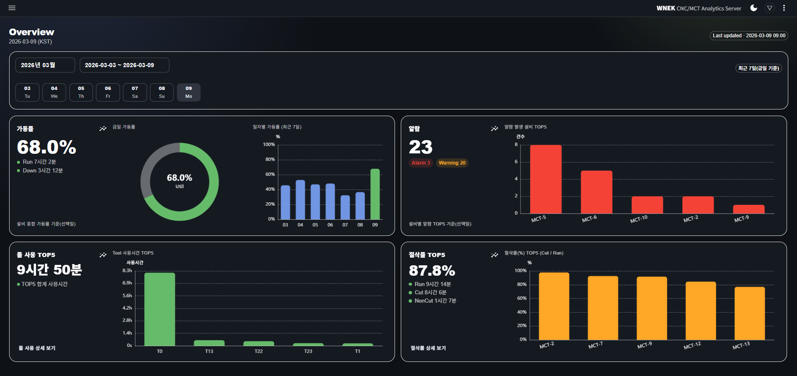
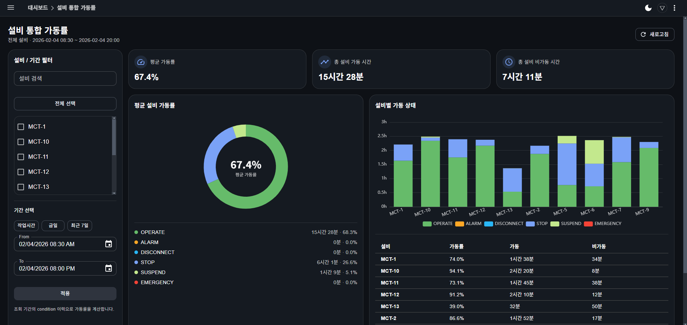
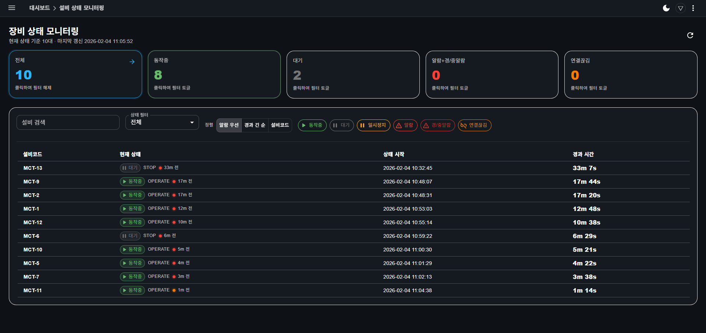
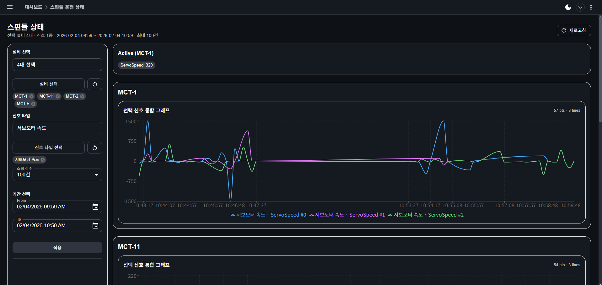

# WNEK CNC/MCT Data Gateway, Analytics Server
MongoDB 기반 CNC/MCT 설비 데이터 수집·모니터링·분석 대시보드 (단독 개발)

기획부터 설계·백엔드·프론트엔드까지 **단독으로 진행한 프로젝트**입니다.

기존 회사 표준이던 MSSQL 중심 구조에서 벗어나,
운영 데이터를 **MongoDB로 수집·저장**하고 Java 서버에서 직접 연동하여 API를 구성,
해당 API 기반으로 클라이언트 UI까지 직접 구현했습니다.

현재 사내 사업계획서에 포함되어 있으며, **한국저작권위원회 프로그램 저작권 등록 완료** (제 C-2025-044333-2호, 2026.03)된 소프트웨어입니다.
타 프로젝트 납품 시 본 솔루션을 포함하여 제공하는 형태로 사업화를 진행하고 있습니다.

> 본 문서와 화면은 실무 프로젝트 기반이며,
> 보안 정책에 따라 일부 정보는 마스킹 처리되었습니다.

---

## 배경

- 기존 시스템은 MSSQL 중심 구조로, 실시간 조회 및 지표 확장에 제약이 있었음
- 운영 상태 확인을 위해 여러 화면을 반복적으로 확인해야 하는 불편함
- 운영 현황을 한눈에 파악할 수 있는 **통합 대시보드 필요**

---

## 목표

- 운영 현황을 **즉시 파악**할 수 있는 대시보드 제공
- 실시간 데이터와 누적 데이터를 **동시에 확인 가능한 구조** 설계
- 기존 RDB 의존도를 낮추고, 지표 확장에 유연한 데이터 구조 적용

---

## Architecture

```
Equipment Data
      ↓
   MongoDB
      ↓
Java Server (MongoDB 연동 / API)
      ↓
 Web Client UI
```

- 운영 데이터를 MongoDB 컬렉션 단위로 수집·관리
- Java 서버에서 MongoDB를 직접 연동하여 집계 및 조회 API 구현
- 클라이언트는 API 기반으로 상태 및 지표 시각화
- NoSQL 구조를 활용하여 지표 추가 시 스키마 변경 부담 최소화

---

## Why MongoDB

- 수집 데이터 특성상 **스키마가 자주 바뀌고 지표가 계속 추가**됨
- MSSQL에서는 컬럼 추가 및 프로시저 수정 비용이 큼
- MongoDB 도입으로:
  - 항목별 데이터 구조를 유연하게 수용
  - 지표 추가 시 서버·DB 구조 변경 최소화
  - 실시간 데이터와 집계 데이터 분리 관리

---

## Screenshots

### Home Dashboard

전체 운영 현황 요약 화면



---

### Integrated Utilization & Equipment Status

통합 가동률과 개별 상태를 동시에 모니터링하는 화면




---

### Trend View

운영 지표의 시간별 변화를 확인하는 트렌드 화면



---

## 담당 업무

- MongoDB 기반 데이터 모델 및 컬렉션 구조 설계
- Java 서버에 MongoDB 연동 구조 신규 적용
- 상태 판단 기준 정의 및 집계 API 구현
- 실시간/누적 데이터를 고려한 API 설계
- API 기반 클라이언트 UI 개발
- 운영자 관점에서 빠르게 파악 가능한 화면 구성

---

## 고려 사항

- 지표 추가 시 기존 구조 변경 최소화
- 실시간 조회 성능과 집계 성능 간의 균형
- 사용자가 한눈에 상황을 파악할 수 있는 화면 구성

---

## Tech Stack

| 구분 | 기술 |
|------|------|
| Backend | Java (MongoDB Direct Integration) |
| Database | MongoDB |
| Frontend | React |
| Domain | 실시간 모니터링 / 운영 대시보드 |

---

## 현황

- **현장 배포 완료** / 운영 중
- 한국저작권위원회 **프로그램 저작권 등록 완료** (제 C-2025-044333-2호)
- 사업계획서 포함, 타 프로젝트 납품 시 솔루션으로 제공 예정
